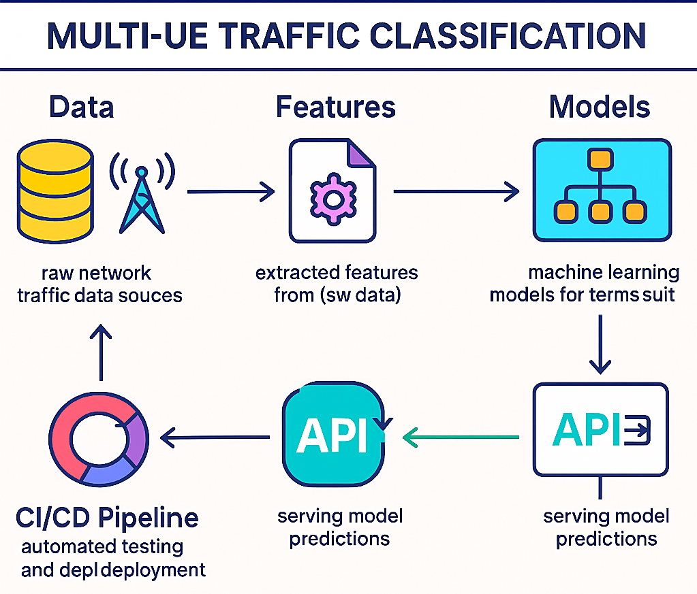
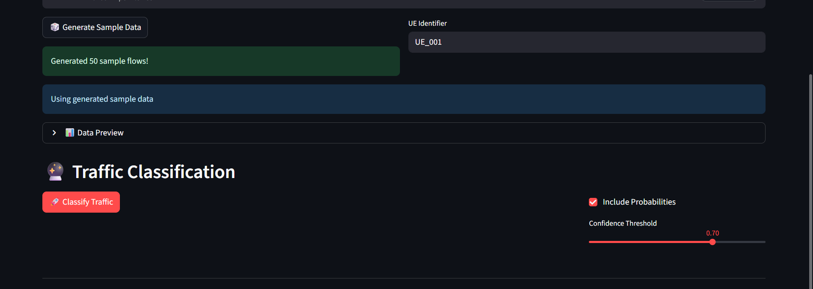
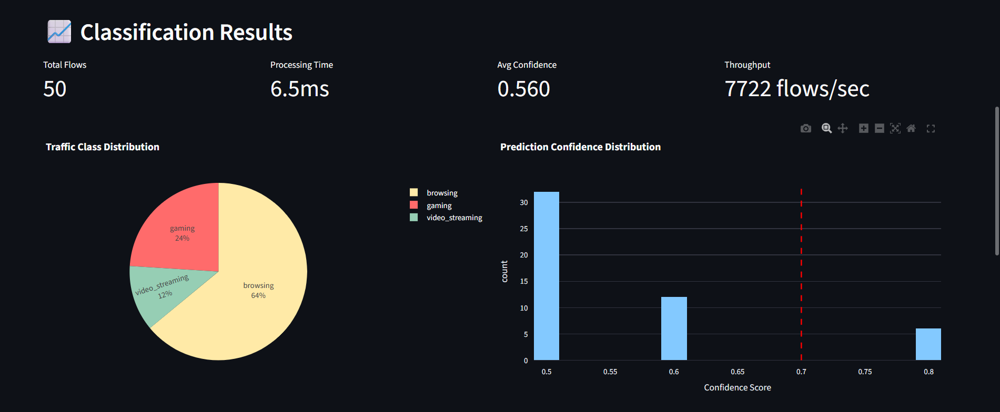
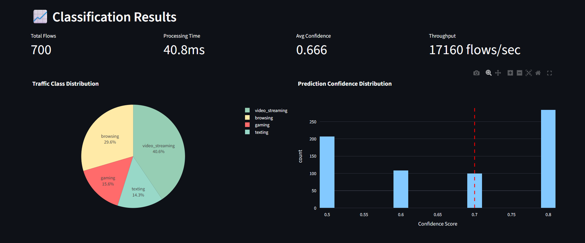
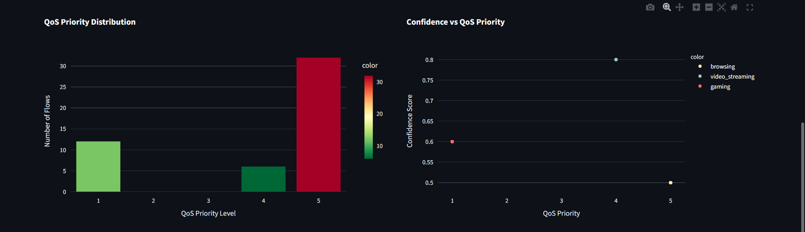

# Samsung EnnovateX 2025 AI Challenge Submission

- **Problem Statement** - Classify User Application Traffic at the Network in a Multi-UE Connected Scenario
- **Team name** - 01
- **Team members (Names)** - Sumit Kumar Singh, Devashish Kumar Rishi, Manish Kumar
- **Demo Video Link** - [Link to YouTube Demo Video]

### Project Artefacts

- **Technical Documentation** - All technical details are provided in this document.
- **Source Code** - The complete source code is available in the `src` directory of this repository.
- **Models Used** - This project uses a custom-trained XGBoost model. No external pre-trained models from Hugging Face were used.
- **Models Published** - The trained XGBoost model is published on Hugging Face at the following link: [Link to Published Model on Hugging Face]
- **Datasets Used** - 
  - [CIC-IDS2017](https://www.unb.ca/cic/datasets/ids-2017.html)
  - [CIC-UNSW-NB15](https://www.unb.ca/cic/datasets/cic-unsw-nb15.html)
  - [UNSW-NB15](https://research.unsw.edu.au/projects/unsw-nb15-dataset)
  - **Synthetic Datasets (Generated)**:
    - `data/synthetic/all_synthetic_flows.csv`
    - `data/synthetic/audio_calls_flows.csv`
    - `data/synthetic/browsing_flows.csv`
    - `data/synthetic/gaming_flows.csv`
    - `data/synthetic/texting_flows.csv`
    - `data/synthetic/video_calls_flows.csv`
    - `data/synthetic/video_streaming_flows.csv`
    - `data/synthetic/video_uploads_flows.csv`
- **Datasets Published** - The synthetic dataset generated for this project is published on Hugging Face at the following link: [[Link to Published Dataset on Hugging Face](https://huggingface.co/datasets/manish061/ennovatex-io/tree/main)]

### Attribution

This project was built from scratch and does not build on top of any existing open-source project.

---

# Technical Documentation

## Introduction

This project, the Multi-UE Traffic Classifier, is an AI-powered network traffic classification system designed to optimize Quality of Service (QoS) in 5G and future 6G networks. By accurately identifying different types of traffic (e.g., gaming, video streaming, voice calls) in real-time, the system enables network operators to dynamically allocate resources and prioritize traffic, thereby enhancing the Quality of Experience (QoE) for multiple concurrent users (UEs).

## Problem Description

In modern mobile networks, especially with the advent of 5G, a diverse range of applications with varying network requirements compete for limited resources. For instance, online gaming requires ultra-low latency, while video streaming demands high throughput. Traditional network management systems often treat all traffic equally, leading to suboptimal performance and poor user experience. This project addresses the challenge of fine-grained traffic classification in a multi-user environment, which is a critical prerequisite for implementing intelligent, application-aware QoS policies.

## System Architecture

The system is designed with a modular architecture, comprising several key components that work together to provide a complete solution for traffic classification.

Here is the system workflow:




1.  **Data Ingestion and Processing**: This component is responsible for ingesting network traffic data from various sources, including PCAP files and live network interfaces. It uses `CICFlowMeter` to extract flow-level features from the raw packet data.

2.  **Synthetic Data Generation**: To supplement real-world data and create a balanced dataset for training, a synthetic data generator is included. This tool can create realistic flow data for various application classes based on predefined characteristics.

3.  **Feature Engineering**: The `FlowFeatureExtractor` module processes the raw flow data to create a rich set of features. This includes basic flow statistics, timing features, behavioral features, and features based on sliding windows to capture the temporal dynamics of the traffic.

4.  **Model Training and Evaluation**: The core of the system is an XGBoost-based machine learning model (`MultiUETrafficClassifier`). The training pipeline includes UE-based data splitting to prevent data leakage, hyperparameter tuning, and probability calibration to ensure reliable confidence scores. The model is evaluated on a comprehensive set of metrics, including accuracy, F1-score, and top-2 accuracy.

5.  **API and Serving**: The trained model is exposed through a FastAPI-based REST API for real-time inference. The API provides endpoints for prediction, health checks, and retrieving model information. A command-line interface (CLI) is also available for batch processing and demonstration purposes.

6.  **Dashboard**: A Streamlit-based dashboard is provided for visualizing the model's predictions and monitoring the system's performance.


<!--  -->




## Model Details

The traffic classification model is an XGBoost (Extreme Gradient Boosting) classifier. XGBoost was chosen for its high performance, scalability, and ability to handle a large number of features.

-   **Model Architecture**: The model is a standard XGBoost classifier with the objective function set to `multi:softprob` for multi-class classification.
-   **Training Process**: The model is trained on a combination of real-world and synthetic data. The training process involves:
    1.  **Data Splitting**: The data is split into training, validation, and test sets using a UE-based splitting strategy to prevent a single user's data from appearing in multiple sets.
    2.  **Feature Engineering**: A wide range of features are extracted from the flow data.
    3.  **Training**: The model is trained on the training set, with early stopping used to prevent overfitting. Class weights are used to handle class imbalance.
    4.  **Calibration**: The model's output probabilities are calibrated on the validation set using Platt scaling (sigmoid calibration) to ensure that the confidence scores are reliable.
-   **Evaluation Metrics**: The model's performance is evaluated using the following metrics:
    -   Macro F1-Score
    -   Per-Class F1-Score
    -   Top-2 Accuracy
    -   Confusion Matrix
    -   Inference Latency

*You can add a screenshot of the Confusion Matrix here.*

## Implementation Details

### Prerequisites

-   Python 3.10 or higher
-   `pip` and `venv`

### Installation

1.  **Clone the repository**:
    ```bash
    git clone <repository-url>
    cd multi_ue_traffic_classifier
    ```

2.  **Create and activate a virtual environment**:
    ```bash
    python -m venv venv
    # On Windows
    .\venv\Scripts\Activate.ps1
    # On macOS/Linux
    source venv/bin/activate
    ```

3.  **Install the required dependencies**:
    ```bash
    pip install -r requirements.txt
    pip install -r requirements-dev.txt
    ```

### Usage

The project provides several scripts in the `scripts` directory to run the different stages of the MLOps pipeline.

1.  **Generate Synthetic Data (Optional)**:
    ```bash
    python scripts/generate_synthetic_data.py
    ```

2.  **Train the Model**:
    ```bash
    python scripts/train_model.py --config configs/model_xgb.yaml
    ```
    *You can add a screenshot of the training process output here.*

3.  **Evaluate the Model**:
    ```bash
    python scripts/evaluate_model.py --model models/traffic_classifier.joblib
    ```
    *You can add a screenshot of the evaluation results here.*

4.  **Serve the API**:
    ```bash
    python scripts/serve_api.py --port 8000
    ```

5.  **Run the CLI Demo**:
    ```bash
    python -c "from src.traffic_classifier.serving.cli import demo; demo()"
    ```

## Future Work

This project lays a strong foundation for a sophisticated traffic management system. The following keywords highlight key areas for future development to enhance its capabilities, accuracy, and deployment potential.

-   **Advanced Deep Learning Models for Temporal Analysis**
    -   Move beyond statistical flow features to **End-to-End Learning** directly from **packet-level sequences**.
    -   Utilize **LSTMs (Long Short-Term Memory)** networks to model the temporal dependencies and stateful nature of traffic flows.
    -   Explore **Transformers** with **Attention Mechanisms** to identify the most influential packets for classification, potentially leading to higher accuracy for encrypted or complex application protocols.

-   **Graph-Based Feature Engineering with GNNs**
    -   Model network traffic as a dynamic graph, where UEs, servers, and services are nodes and flows are edges.
    -   Employ **Graph Neural Networks (GNNs)** to learn from the relational structure of **service-to-service communication** and **UE behavior graphs**.
    -   This approach could help in identifying coordinated activities (e.g., a video call involving multiple media streams) and classifying applications based on their broader communication patterns.

-   **Real-time Adaptation with Online and Federated Learning**
    -   Address **concept drift**, where network patterns and application behaviors change over time, rendering static models obsolete.
    -   Implement an **Online Learning** pipeline for **real-time adaptation**, allowing the model to perform **incremental learning** from a live data stream without requiring full, costly retraining.
    -   Investigate **Federated Learning** to train models across multiple edge nodes or base stations without centralizing raw traffic data. This enhances privacy and scalability, and enables the detection of **zero-day applications** by learning from distributed, diverse data sources.

-   **Explainable AI (XAI) and Enhanced Monitoring**
    -   Integrate **XAI** frameworks like **SHAP (SHapley Additive exPlanations)** or **LIME (Local Interpretable Model-agnostic Explanations)** into the dashboard. This would provide clear, human-readable explanations for individual predictions, building trust with network operators.
    -   Enhance the dashboard for **real-time monitoring** of network KPIs (Key Performance Indicators) and add modules for **anomaly detection** in traffic patterns.
    -   Provide tools for **interactive analysis**, allowing operators to drill down into specific UE or application behavior to diagnose issues.

-   **Edge Deployment and Inference Optimization**
    -   Optimize the model for deployment on **Edge Computing** platforms, specifically **MEC (Multi-access Edge Computing)** servers, to minimize latency between detection and action.
    -   Apply techniques like **Model Quantization** (reducing precision from FP32 to INT8) and **Pruning** to decrease the model's size and computational footprint.
    -   Convert the model to a standardized format like **ONNX (Open Neural Network Exchange)** and use inference accelerators such as **TensorRT** to achieve ultra-**low-latency inference** on specialized edge hardware.

-   **Security Enhancement via Anomaly Detection**
    -   Extend the system's capabilities to include **network security** applications as a natural next step from classification.
    -   Use the traffic classifier's output as a baseline to build an **unsupervised learning** model for **anomaly detection**. This could identify patterns associated with **malicious traffic**, enabling use cases like **DDoS detection**, botnet activity identification, or flagging unusual data exfiltration.
